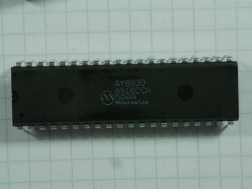

# testAY8930
The Microchip YM8930 is a 40-pin chip which has the same function and register-level interface as the General Instruments
[AY-3-8910](https://en.wikipedia.org/wiki/General_Instrument_AY-3-8910 "Wikipedia: General Instrument AY-3-8910").
The AY8930, though, has a number of enhancements over the AY-3-8910.
It has three envelope shapers, 16-bit tone generator control registers, an improved
noise generator and duty cycle control, amongst other things.

This Arduino sketch tests an AY8930 chip by setting up some initial configuration and generating sounds.
The Arduino's ADC (analog-to-digital converter) is used, along with a pot, to control the sound generator.

## AY8930 Chip

