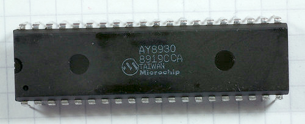

# testAY8930
The Microchip AY8930 is a 40-pin chip which has the same function and register-level interface as the General Instruments
[AY-3-8910](https://en.wikipedia.org/wiki/General_Instrument_AY-3-8910 "Wikipedia: General Instrument AY-3-8910").
The AY8930, though, has a number of enhancements over the AY-3-8910.
It has three envelope shapers, 16-bit tone generator control registers, an improved
noise generator and duty cycle control, amongst other things.

This Arduino sketch tests an AY8930 chip by setting up some initial configuration and generating sounds.
The Arduino's ADC (analog-to-digital converter) is used, along with a pot, to control the sound generator.

## Test Plan
We want to verify both that the chip works and that it has the
enhanced functionality (i.e. that it really is an AY8930).
So the Arduino sketch switches the chip into enhanced mode by setting the
upper four bits of the ENVELOPE register (R13) to 1010 or 1011.
The function 'aywrite()' that accesses the chip must keep track of
which bank is selected and change banks if required to allow us to set
up registers beyond the 16 of the AY-3-8910.
'aywrite()' takes register numbers from 0 to 31, with 0-15 being in
Bank A and 16-31 being in Bank B.

Once we can use the enhanced features of the AY8930, we set it up
in such a way that listening to the output will demonstrate that it
has more than one envelope generator.
Channel A is set up to produce a tone, and Channel B produces noise.
Both channels are fed through envelope generators set to produce a
triangle-wave envelope (rampling up and down alternately).
Channel A tone frequency and envelope period are controllable via
pots connected to the Arduino analog inputs 0 and 1.
Channel B envelope period and noise parameters are fixed.

When the sketch runs, we should hear a pulsating tone and a pulsating
noise.
Only the tone should be controllable by the pots; the noise should
be unaffected.
I/O Port B of the AY8930 should count up at 50Hz.
LEDs connected to higher-order bits (e.g. pins 9 and 10 of the chip)
should flash at a moderate rate.

## AY8930 Chip

## AY8930 on Breadboard

